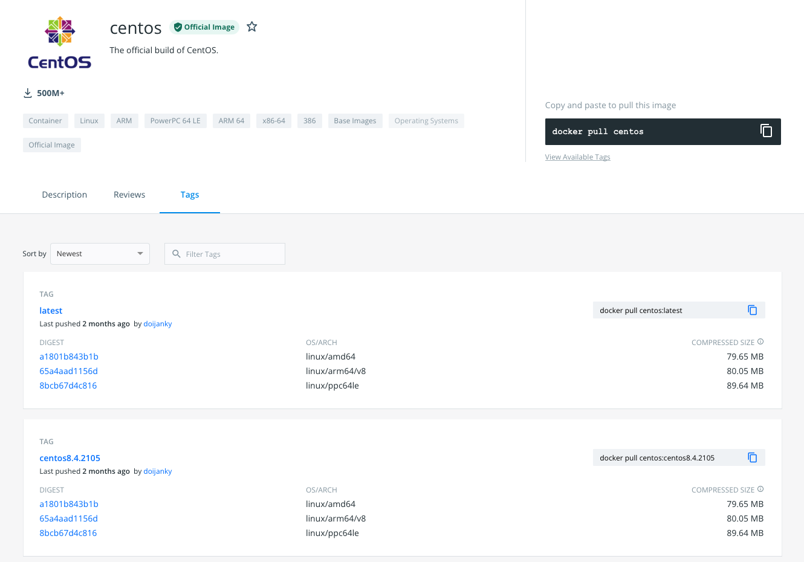
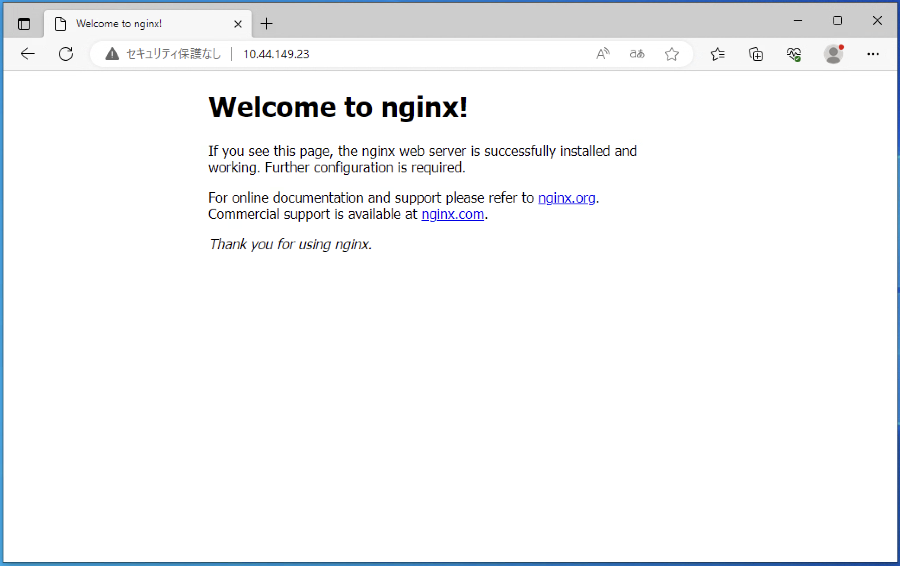
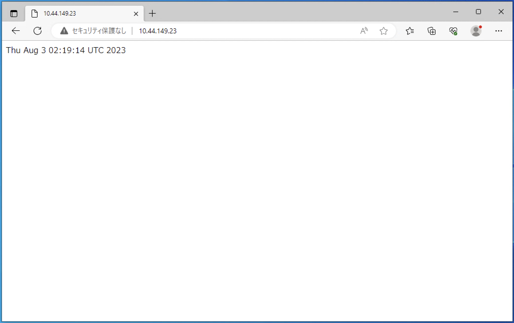
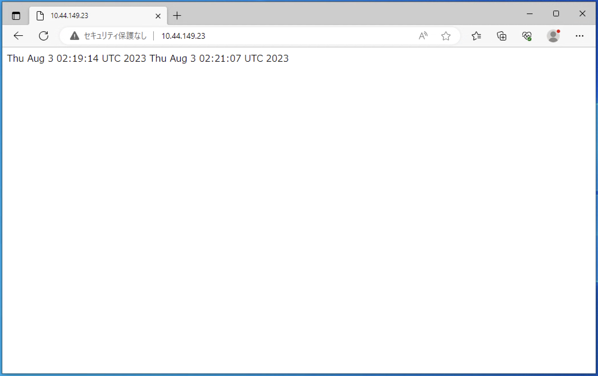

# Dockerハンズオン

## 1. Linuxホストの確認

### 1-1. OSの確認

利用している環境のOSを確認して下さい。本環境では、Ubuntu 20を利用しています。

```bash
cat /etc/lsb-release
```

出力を確認すると`Ubuntu 20.04.5 LTS`が利用されている事がわかります。

```
DISTRIB_ID=Ubuntu
DISTRIB_RELEASE=22.04
DISTRIB_CODENAME=jammy
DISTRIB_DESCRIPTION="Ubuntu 22.04.2 LTS"
```

### 1-2. ネットワークの確認

`ip address`コマンドでNICのアドレスを確認します。

```bash
$  ip a
1: lo: <LOOPBACK,UP,LOWER_UP> mtu 65536 qdisc noqueue state UNKNOWN group default qlen 1000
    link/loopback 00:00:00:00:00:00 brd 00:00:00:00:00:00
    inet 127.0.0.1/8 scope host lo
       valid_lft forever preferred_lft forever
    inet6 ::1/128 scope host
       valid_lft forever preferred_lft forever
2: ens192: <BROADCAST,MULTICAST,UP,LOWER_UP> mtu 1500 qdisc mq state UP group default qlen 1000
    link/ether 00:50:56:ae:8d:b2 brd ff:ff:ff:ff:ff:ff
    altname enp11s0
    inet 10.44.149.23/21 metric 100 brd 10.44.151.255 scope global dynamic ens192
       valid_lft 691002sec preferred_lft 691002sec
    inet6 fe80::250:56ff:feae:8db2/64 scope link
       valid_lft forever preferred_lft forever
```

### 1-3. コンピュートリソースの確認

CPUを確認します。インスタンスにはCPUは1つのみ搭載されています。

```bash
$ cat /proc/cpuinfo | head -n5
processor       : 0
vendor_id       : AuthenticAMD
cpu family      : 23
model           : 49
model name      : AMD EPYC 7502P 32-Core Processor
```

メモリーを確認します。メモリーは1GiBで構成されています。

```bash
$ cat /proc/meminfo | grep MemTotal
MemTotal:        2010852 kB
```

## 2. dockerのインストール

各種環境に対するdockerのインストール方法は[こちら](https://docs.docker.com/engine/install/)に説明があります。今回は[Ubuntuにインストールする方法](https://docs.docker.com/engine/install/ubuntu/)に基づいて、インストールを行います。

### 2-1. 準備

すでにdockerコンポーネントがインストールされている場合、一度アンインストールします。

```bash
sudo apt-get remove docker docker-engine docker.io containerd runc
```

dockerに必要なコンポーネントを追加します。

```bash
sudo apt-get update
```

```bash
sudo apt-get install ca-certificates curl gnupg lsb-release
```

### 2-2. リポジトリの追加

dockerリポジトリを追加します。

```bash
curl -fsSL https://download.docker.com/linux/ubuntu/gpg | sudo gpg --dearmor -o /usr/share/keyrings/docker-archive-keyring.gpg
```

```bash
echo "deb [arch=$(dpkg --print-architecture) signed-by=/usr/share/keyrings/docker-archive-keyring.gpg] https://download.docker.com/linux/ubuntu $(lsb_release -cs) stable" | sudo tee /etc/apt/sources.list.d/docker.list > /dev/null
```

dockerリポジトリが追加されていることを確認します。

```bash
$ cat /etc/apt/sources.list.d/docker.list
deb [arch=amd64 signed-by=/usr/share/keyrings/docker-archive-keyring.gpg] https://download.docker.com/linux/ubuntu jammy stable
```

### 2-3. インストール

dockerリポジトリからdockerに必要なコンポーネントをインストールします。

```bash
sudo apt-get update && sudo apt-get install -y docker-ce docker-ce-cli containerd.io
```

> HTMLをコピー&ペーストしている場合、2-2の内容が正しくペーストされない場合があります。エラーが発生する場合は入力内容を確認してください。

### 2-4. インストール確認

dockerがインストールされたことを確認します。`/usr/bin/docker`にCLIがインストールされていることが確認できます。

```bash
which docker
```

デーモンとして`containerd`と`dockerd`が起動していることを確認します。

```bash
ps aux | grep container
```

プロセスとして`containerd`と`dockerd`が起動していることが確認できます。

```bash
root        2615  0.1  2.1 1283200 42716 ?       Ssl  23:37   0:00 /usr/bin/containerd
root        2785  0.2  3.7 1318908 75796 ?       Ssl  23:37   0:00 /usr/bin/dockerd -H fd:// --containerd=/run/containerd/containerd.sock
ubuntu      2988  0.0  0.1   7004  2212 pts/0    S+   23:38   0:00 grep --color=auto container
```

インターフェースを確認します。

```bash
ip address
```

ブリッジインターフェースとして`docker0`が追加され、IPアドレスとして`172.17.0.1`が設定されていることが確認できます。

```bash
1: lo: <LOOPBACK,UP,LOWER_UP> mtu 65536 qdisc noqueue state UNKNOWN group default qlen 1000
    link/loopback 00:00:00:00:00:00 brd 00:00:00:00:00:00
    inet 127.0.0.1/8 scope host lo
       valid_lft forever preferred_lft forever
    inet6 ::1/128 scope host
       valid_lft forever preferred_lft forever
2: ens192: <BROADCAST,MULTICAST,UP,LOWER_UP> mtu 1500 qdisc mq state UP group default qlen 1000
    link/ether 00:50:56:ae:8d:b2 brd ff:ff:ff:ff:ff:ff
    altname enp11s0
    inet 10.44.149.23/21 metric 100 brd 10.44.151.255 scope global dynamic ens192
       valid_lft 689238sec preferred_lft 689238sec
    inet6 fe80::250:56ff:feae:8db2/64 scope link
       valid_lft forever preferred_lft forever
3: docker0: <NO-CARRIER,BROADCAST,MULTICAST,UP> mtu 1500 qdisc noqueue state DOWN group default
    link/ether 02:42:b3:1e:29:8e brd ff:ff:ff:ff:ff:ff
    inet 172.17.0.1/16 brd 172.17.255.255 scope global docker0
       valid_lft forever preferred_lft forever
```

`docker info`コマンドで状態を確認します。

```bash
docker info
```

Clientの情報は出力されますが、Server側の情報がエラーとなって確認することができません。これはdockerユーザーグループに所属していないユーザーが、dockerを利用することができないためです。

```bash
Client: Docker Engine - Community
 Version:    24.0.5
 Context:    default
 Debug Mode: false
 Plugins:
  buildx: Docker Buildx (Docker Inc.)
    Version:  v0.11.2
    Path:     /usr/libexec/docker/cli-plugins/docker-buildx
  compose: Docker Compose (Docker Inc.)
    Version:  v2.20.2
    Path:     /usr/libexec/docker/cli-plugins/docker-compose

Server:
ERROR: permission denied while trying to connect to the Docker daemon socket at unix:///var/run/docker.sock: Get "http://%2Fvar%2Frun%2Fdocker.sock/v1.24/info": dial unix /var/run/docker.sock: connect: permission denied
errors pretty printing info
```

現在ログインしているユーザー(ubuntu)をdockerユーザーグループに追加します。

```bash
sudo usermod -aG docker $USER
```

### 2-5. Linuxホストへの再ログイン

グループの修正を反映させるにはLinuxホストへの再ログインが必要なため、一度ログアウトして再ログインします。

```bash
exit
```

exit後、AWSマネジメントコンソールで再度「接続」をクリックしてもう一度コンソールを開きます。

`id`コマンドで自身のユーザー情報を確認します。

```bash
id
```

dockerユーザーグループに所属していることが確認できます。

```bash
uid=1000(ubuntu) gid=1000(ubuntu) groups=1000(ubuntu),4(adm),20(dialout),24(cdrom),25(floppy),27(sudo),29(audio),30(dip),44(video),46(plugdev),119(netdev),120(lxd),999(docker)
```

### 2-6. 確認

再度`docker info`を実行してサーバーの情報が出力可能になったことを確認します。

```bash
$ docker info
Client: Docker Engine - Community
 Version:    24.0.5
 Context:    default
 Debug Mode: false
 Plugins:
  buildx: Docker Buildx (Docker Inc.)
    Version:  v0.11.2
    Path:     /usr/libexec/docker/cli-plugins/docker-buildx
  compose: Docker Compose (Docker Inc.)
    Version:  v2.20.2
    Path:     /usr/libexec/docker/cli-plugins/docker-compose

Server:
 Containers: 0
  Running: 0
  Paused: 0
  Stopped: 0
 Images: 0
 Server Version: 24.0.5
... snip
```

ここまでで、Ubuntu Linuxに対するdockerのインストールが完了し、dockerの利用が可能になりました。


## 3. dockerの利用

### 3-1 . Docker Hubへのログイン

>  本ハンズオンではDocker Hubのアカウントを利用してDocker Hubに対してコンテナイメージをダウンロード・アップロードします。Docker Hubのアカウントを持っていない場合は[こちら](https://hub.docker.com/signup)から登録してDocker IDを取得してください。

Docker Hubは無償で利用することができるコンテナレジストリです。ユーザーのアカウントタイプに応じて、コンテナイメージのダウンロード(pull) には制限があります。制限は接続元のIPアドレスに基づきます。 匿名ユーザーの場合、1つのIPアドレスにつき、6時間ごとに100 pullに設定されています。 認証されているユーザーの場合は、6 時間ごとに200プルです。有償のDockerサブスクリプションのユーザーには制限はありません。

`docker login`コマンドでレジストリにログインします。レジストリを指定しない場合は、Docker Hubに対するログインになります。(プライベートレジストリにログインする場合は、`docker login registry.netone.co.jp`のようにレジストリを指定します。)

```bash
$ docker login
Login with your Docker ID to push and pull images from Docker Hub. If you don't have a Docker ID, head over to https://hub.docker.com to create one.
Username: [username]
Password: *********
WARNING! Your password will be stored unencrypted in /home/ubuntu/.docker/config.json.
Configure a credential helper to remove this warning. See
https://docs.docker.com/engine/reference/commandline/login/#credentials-store

Login Succeeded
```

### 3-2. コンテナイメージの取得

コンテナイメージは[Docker Hub](https://hub.docker.com/search?type=image)などのレジストリにあるものを利用可能です。`docker search`コマンドを利用すると、Docker Hub上にあるコンテナイメージを検索することが可能です。

```bash
$ docker search centos
NAME                                         DESCRIPTION                                     STARS     OFFICIAL   AUTOMATED
centos                                       DEPRECATED; The official build of CentOS.       7621      [OK]
kasmweb/centos-7-desktop                     CentOS 7 desktop for Kasm Workspaces            39
bitnami/centos-base-buildpack                Centos base compilation image                   0                    [OK]
couchbase/centos7-systemd                    centos7-systemd images with additional debug…   8                    [OK]
continuumio/centos5_gcc5_base                                                                3
... snip
```

`docker pull`コマンドdで`centos`コンテナイメージを取得します。

```bash
docker pull centos
```

以下のエラーが表示された場合、Docker Hubへのログインが正常にできていない可能性がありますので「Docker Hubへのログイン」を再度確認してください。

```bash
Error response from daemon: toomanyrequests: You have reached your pull rate limit. You may increase the limit by authenticating and upgrading: https://www.docker.com/increase-rate-limit
```

Docker Hubからコンテナイメージがダウンロードされます。

```bash
Using default tag: latest
latest: Pulling from library/centos
a1d0c7532777: Pull complete
Digest: sha256:a27fd8080b517143cbbbab9dfb7c8571c40d67d534bbdee55bd6c473f432b177
Status: Downloaded newer image for centos:latest
docker.io/library/centos:latest
```

ローカルホスト上に存在するコンテナイメージは`docker images`で確認可能です。

```bash
docker images
```

コンテナイメージは`Repository:Tag`というフォーマットで表現されます。Tagを明示的に指定しない場合、自動的に`latest`というTagが指定されるため、`centos:latest`がダウンロードされました。

```
REPOSITORY   TAG       IMAGE ID       CREATED         SIZE
centos       latest    5d0da3dc9764   22 months ago   231MB
```

[Docker HubのcentosのページのTags](https://hub.docker.com/_/centos?tab=tags)をブラウザで開いて確認するとcentosを確認すると、latest以外にもたくさんのタグがあります。



`centos:7`や`centos:8`も同様にpullしてホスト上にダウンロードします。

```bash
docker pull centos:7
```

```bash
docker pull centos:8
```

`docker images`でローカルホスト上にあるコンテナイメージを確認することが可能です。

```bash
$ docker images
REPOSITORY   TAG       IMAGE ID       CREATED         SIZE
centos       7         eeb6ee3f44bd   22 months ago   204MB
centos       8         5d0da3dc9764   22 months ago   231MB
centos       latest    5d0da3dc9764   22 months ago   231MB
```

3種類のコンテナイメージをpullしましたが、`centos:latest`と`centos:8`は同じIMAGE IDを持っています。これは、2つのコンテナイメージの実体が同一であり、1つのコンテナイメージに2つのタグが付与されていることを意味しています。

### 3-3. コンテナの起動

コンテナを起動するには`docker run`コマンドを利用します。以下のコマンドで、`centos:7`イメージを利用してコンテナ内のbashを起動します。

```bash
docker run -it centos:7 bash
```

コマンドプロンプトが変更されたことが確認できます。

### 3-4. コンテナ内の確認

dockerを実行しているホストはUbuntu Linuxでしたが、今回起動したコンテナは`centos:7`を利用してます。コンテナ内で`/etc/redhat-release`を確認すると`CentOS Linux release 7.9.2009 (Core)`として実行されていることを確認できます。

```bash
cat /etc/redhat-release
```

コンテナ内のプロセスを確認すると、bashがPID=1として起動しています。これはコンテナ内のプロセス空間がPIDネームスペースの機能によって、Linuxホストのプロセス空間と隔離されているためです。

```bash
# ps ax
    PID TTY      STAT   TIME COMMAND
      1 pts/0    Ss     0:00 bash
     16 pts/0    R+     0:00 ps ax
```

コンテナ内でCPUとメモリーを確認すると、Linuxホストのと同じ物が見えています。

```bash
# cat /proc/cpuinfo | head -n5
processor       : 0
vendor_id       : AuthenticAMD
cpu family      : 23
model           : 49
model name      : AMD EPYC 7502P 32-Core Processor
# cat /proc/meminfo | grep MemTotal
MemTotal:        2010852 kB
```

コンテナ内のネットワークの状態を確認するため、コンテナにiprouteをインストールします。

```bash
yum install -y iproute
```

`ip address`コマンドでNICを確認します。LinuxホストのNICとは異なるNICとIPアドレスが確認できます。

```bash
ip address
```

出力例

```bash
1: lo: <LOOPBACK,UP,LOWER_UP> mtu 65536 qdisc noqueue state UNKNOWN group default qlen 1000
    link/loopback 00:00:00:00:00:00 brd 00:00:00:00:00:00
    inet 127.0.0.1/8 scope host lo
       valid_lft forever preferred_lft forever
4: eth0@if5: <BROADCAST,MULTICAST,UP,LOWER_UP> mtu 1500 qdisc noqueue state UP group default
    link/ether 02:42:ac:11:00:02 brd ff:ff:ff:ff:ff:ff link-netnsid 0
    inet 172.17.0.2/16 brd 172.17.255.255 scope global eth0
       valid_lft forever preferred_lft forever
```

コンテナのルートテーブルを確認すると、デフォルトゲートウェイとして`172.17.0.1`が設定されています。

> 172.17.0.1はdockerのインストールにより構成された、docker0ブリッジのIPアドレスです。

```bash
# ip route
default via 172.17.0.1 dev eth0
172.17.0.0/16 dev eth0 proto kernel scope link src 172.17.0.2
```

デフォルトゲートウェイにpingを打つと応答があります。コンテナに接続されたNICはdocker0ブリッジに接続されているためです。

```bash
# ping -c 2 172.17.0.1
PING 172.17.0.1 (172.17.0.1) 56(84) bytes of data.
64 bytes from 172.17.0.1: icmp_seq=1 ttl=64 time=0.043 ms
64 bytes from 172.17.0.1: icmp_seq=2 ttl=64 time=0.056 ms

--- 172.17.0.1 ping statistics ---
2 packets transmitted, 2 received, 0% packet loss, time 1018ms
rtt min/avg/max/mdev = 0.043/0.049/0.056/0.009 ms
```

curlで```www.google.com```にアクセスできることを確認します。コンテナからインターネットに対して通信できていることが確認できます。これはコンテナから送信されたパケットがLinuxホストでSNATとされ、インターネットに送信されているためです。

```bash
# curl -s -o /dev/null -D - https://www.google.com
HTTP/1.1 200 OK
Date: Fri, 27 Jan 2023 08:49:20 GMT
```

コンテナからexitします。

```bash
exit
```

`iptabels-save`コマンドでiptablesのエントリーを確認します。172.17.0.0/16を送信元とする通信は「MASQUERADE」によりIPマスカレードされています。

```bash
$ sudo iptables-save | grep MASQUERADE
-A POSTROUTING -s 172.17.0.0/16 ! -o docker0 -j MASQUERADE
```

### 3-5. コンテナの実行状態と削除

`docker ps`コマンドで実行中のコンテナを一覧表示することが可能です。ここまでで実行したコンテナはbashを起動するものだったため、「exit」コマンドによりコンテナの実行は終了していますが、Exit状態でLinuxホスト内に残存しています。実行が終了したコンテナは`docker ps -a`コマンドで出力することが可能です。

```bash
$ docker ps -a
CONTAINER ID   IMAGE      COMMAND   CREATED         STATUS                      PORTS     NAMES
fdbfc947af81   centos:7   "bash"    2 minutes ago   Exited (0) 18 seconds ago             dreamy_bhabha
```

終了したコンテナの実行環境をLinuxホストから削除するには、`docker rm`コマンドを利用します。(`docker ps -qa`は終了したコンテナのCONTAINER IDのみを出力するコマンドです)

```bash
docker rm $(docker ps -aq)
```

コンテナが全て削除されたことを確認します。

```bash
docker ps -a
```

### 3-6. コンテナのリソース制限

コンテナ起動時のオプションでCPUやメモリー等のリソースの制限が可能です。

- -m , --memory : メモリの上限（書式： <数値> [<単位>] 、単位は b、k、m、g のいずれか）
- --memory-swap : 合計メモリの上限（メモリ＋スワップ、書式： <数値> [<単位>] 、単位は b、k、m、g のいずれか）
- --memory-reservation : メモリのソフト・リミット（書式： <数値> [<単位>] 、単位は b、k、m、g のいずれか）
- --kernel-memory : カーネル・メモリの上限（書式： <数値> [<単位>] 、単位は b、k、m、g のいずれか）
- -c, --cpu-shares : CPU 共有（CPU shares）を相対値で指定
- --cpu-period : CPU CFS (Completely Fair Scheduler) ピリオドの上限（訳者注：cgroup による CPU リソースへのアクセスを再割り当てする間隔）
- --cpuset-cpus : 実行する CPU の割り当て（0-3, 0,1）
- --cpuset-mems : 実行するメモリ・ノード（MEM）の割り当て（0-3, 0,1）。NUMA システムのみで動作
- --cpu-quota : CPU CFS (Completely Fair Scheduler) のクォータを設定
- --blkio-weight=0 : ブロック I/O ウエイト（相対値）を 10 ～ 1000 までの値でウエイトを設定
- --oom-kill-disable=false : コンテナを OOM killer による停止を無効化するかどうか指定
- --memory-swappiness="" : コンテナがメモリのスワップ度合いを調整。整数値の 0 ～ 100 で指定

利用可能なパラメータの詳細は以下のマニュアルを参照してください。

- [Runtime options with Memory, CPUs, and GPUs](https://docs.docker.com/config/containers/resource_constraints/)

### 3-7. コンテナのバックグラウンド起動


コンテナをバックグラウンドで起動してみます。 (-dオプション) バックグラウンドで起動しているため、docker run実行後もホストのシェルのままになります。```--name```オプションにより、コンテナに任意の名前をつけることが可能です。

```bash
docker run -tid --name mycentos centos:7 bash
```

起動したコンテナを確認します。mycentosコンテナのSTATUSがUPとなっていることを確認します。

```bash
docker ps -a
```

```attach```オプションで起動中にコンテナに接続することが可能です。プロンプトがコンテナに切り替わることを確認します。

```bash
docker attach mycentos
```

コンテナを起動したまま接続を切断するには、```Ctrl+p, Ctrl+q```(コントロールキーを押したまま、p,q)と入力します。exitやログアウトを行うと、このコンテナはbashが終了するためコンテナごと停止してしまいます。

*** ```Ctrl+p, Ctrl+q```と入力して、コンテナのシェルから切断します。*** (切断しないと以降のハンズオンが正しく動作しません)

### 3-8. Linuxホストのネットワーク確認

コンテナが利用するネットワークの状態を確認します。Linuxホスト上ではコンテナ向けにvethペアが作成され、片方はdocker0ブリッジに接続されます。このvethはLinuxホスト上の`ip address`コマンドで確認することが可能です。(veth〜のIDは環境によって異なります。)

```bash
$ ip address
1: lo: <LOOPBACK,UP,LOWER_UP> mtu 65536 qdisc noqueue state UNKNOWN group default qlen 1000
    link/loopback 00:00:00:00:00:00 brd 00:00:00:00:00:00
    inet 127.0.0.1/8 scope host lo
       valid_lft forever preferred_lft forever
    inet6 ::1/128 scope host
       valid_lft forever preferred_lft forever
2: ens192: <BROADCAST,MULTICAST,UP,LOWER_UP> mtu 1500 qdisc mq state UP group default qlen 1000
    link/ether 00:50:56:ae:8d:b2 brd ff:ff:ff:ff:ff:ff
    inet 10.44.149.23/21 metric 100 brd 10.44.151.255 scope global dynamic ens192
       valid_lft 679747sec preferred_lft 679747sec
    inet6 fe80::250:56ff:feae:8db2/64 scope link
       valid_lft forever preferred_lft forever
3: docker0: <BROADCAST,MULTICAST,UP,LOWER_UP> mtu 1500 qdisc noqueue state UP group default
    link/ether 02:42:b3:1e:29:8e brd ff:ff:ff:ff:ff:ff
    inet 172.17.0.1/16 brd 172.17.255.255 scope global docker0
       valid_lft forever preferred_lft forever
    inet6 fe80::42:b3ff:fe1e:298e/64 scope link
       valid_lft forever preferred_lft forever
7: veth4d347a7@if6: <BROADCAST,MULTICAST,UP,LOWER_UP> mtu 1500 qdisc noqueue master docker0 state UP group default
    link/ether c6:ac:59:03:ef:16 brd ff:ff:ff:ff:ff:ff link-netnsid 0
    inet6 fe80::c4ac:59ff:fe03:ef16/64 scope link
       valid_lft forever preferred_lft forever
```

docker0がブリッジとして存在しており、コンテナ向けのvethがdocker0ブリッジに接続されています。

```bash
$ bridge link show
7: veth4d347a7@if6: <BROADCAST,MULTICAST,UP,LOWER_UP> mtu 1500 master docker0 state forwarding priority 32 cost 2
```

vethペアのもう片方にはコンテナが接続されます。コンテナが接続されているvethのペアはネットワークネームスペースを利用して隔離されています。

dockerが作成するネットワークネームスペースは`/var/run/docker/netns`配下でファイルディスクリプタとして管理されています。`nsenter`コマンドを使って、ネットワークネームスペース内でIPアドレスを確認するとコンテナが持つvethのIPアドレスを確認することが可能です。

```bash
$ sudo nsenter --net=$(sudo find /var/run/docker/netns/ -type f) ip address
1: lo: <LOOPBACK,UP,LOWER_UP> mtu 65536 qdisc noqueue state UNKNOWN group default qlen 1000
    link/loopback 00:00:00:00:00:00 brd 00:00:00:00:00:00
    inet 127.0.0.1/8 scope host lo
       valid_lft forever preferred_lft forever
6: eth0@if7: <BROADCAST,MULTICAST,UP,LOWER_UP> mtu 1500 qdisc noqueue state UP group default
    link/ether 02:42:ac:11:00:02 brd ff:ff:ff:ff:ff:ff link-netnsid 0
    inet 172.17.0.2/16 brd 172.17.255.255 scope global eth0
       valid_lft forever preferred_lft forever
```

### 3-9. コンテナのポート公開

コンテナはdocker0ブリッジに接続され、外部から接続できなIPアドレスが割り当てられるため、Webサーバーのような外部に公開したいコンテナの場合は、外部に公開するポートを指定する事が可能です。nginxコンテナを80番ポートで接続できるように公開してみます。

```bash
docker run -p 80:80 --name nginx -d nginx:alpine
```

ローカルPCのブラウザを開き、ハンズオン環境のLinuxホストのIPアドレスの80番ポートにアクセスしてコンテナにアクセスできることを確認します。



コンテナにアクセスできることを確認したら、起動したコンテナを停止・削除します。

```bash
docker rm -f nginx
```

### 3-10. ボリュームのマウント

コンテナ起動中にコンテナ内のディスクに書き込まれたデータはコンテナを削除するのと同時に、削除されます。データを永続化するために、Linuxホストのディスク領域をコンテナにマウントすることが可能です。

以下のコマンドによりLinuxホストにindex.htmlファイルを作成します。index.htmlには現在の時刻が記録されます。

```bash
mkdir $HOME/contents
cd $HOME/contents
date >> index.html
cat index.html
```

カレントディレクトリをコンテナ内の`/usr/share/nginx/html`ディレクトリとしてマウントして、nginxを起動します。

```bash
docker run -tid --name nginx -p 80:80 -v $PWD:/usr/share/nginx/html nginx:alpine
```

再度ブラウザでアクセスすると、dateコマンドの出力が表示されます。



index.htmlファイルにdateコマンドの結果を追加してindex.htmlの内容を更新します。

```bash
date >> index.html
cat index.html
```

ブラウザをリロードすると追記したタイムスタンプが表示され、index.htmlの変更内容がコンテナ内から認識されていることが確認できます。



### 3-11. コンテナのログ

コンテナ内で起動するアプリケーションのログは`docker logs`コマンドで確認することが可能です。

```bash
docker logs nginx
```

コンテナ内で実行されるアプリケーションの標準出力・標準エラー出力の内容が`docker logs`で表示されるため、コンテナ内で実行されるアプリケーションは各種ログを標準出力にする修正が必要です。

例えば、現在実行しているnginxコンテナイメージの設定ファイルを確認してみます。

```bash
docker exec nginx cat /etc/nginx/nginx.conf | grep log
```

エラーログとアクセスログの出力先としてそれぞれ、`/var/log/nginx/error.log`と`/var/log/nginx/access.log`が設定されています。

```bash
error_log  /var/log/nginx/error.log notice;
    log_format  main  '$remote_addr - $remote_user [$time_local] "$request" '
    access_log  /var/log/nginx/access.log  main;
```

各ファイルを確認すると、`/dev/stdout`と`/dev/stderr`に対するシンボリックリンクとなっており、エラーの出力先が標準出力・エラー出力に修正されていることが確認できます。

```bash
docker exec nginx ls -l /var/log/nginx/access.log
```

```bash
docker exec nginx ls -l /var/log/nginx/error.log
```

起動したコンテナを削除・停止します。

```bash
docker rm -f nginx
```

### 3-12. コンテナイメージのビルド

Dockerfileを作成して、コンテナイメージを作成します。以下の内容で`$HOME/contents/Dockerfile`を作成します。COPYコマンドで`$HOME/contents/index.html`を`/var/www/html`にコピーしています。

```dockerfile
FROM ubuntu:latest
RUN apt-get update && apt-get install -y nginx && rm -rf /var/lib/apt/lists/*
RUN ln -sf /dev/stdout /var/log/nginx/access.log && ln -sf /dev/stderr /var/log/nginx/error.log
COPY index.html /var/www/html/
EXPOSE 80
CMD ["/usr/sbin/nginx", "-g", "daemon off;"]
```

上記内容のコピー&ペーストが難しい場合、以下のコマンドでDockerfileの作成が可能です。

```bash
cat <<EOF > $HOME/contents/Dockerfile
FROM ubuntu:latest
RUN apt-get update && apt-get install -y nginx && rm -rf /var/lib/apt/lists/*
RUN ln -sf /dev/stdout /var/log/nginx/access.log && ln -sf /dev/stderr /var/log/nginx/error.log
COPY index.html /var/www/html/
EXPOSE 80
CMD ["/usr/sbin/nginx", "-g", "daemon off;"]
EOF
```

`docker build`コマンドでコンテナイメージを作成します。デフォルトで`Dockerfile`を参照するため、一般的には`Dockerfile`という名称が利用されます。(`-f`オプションを指定して異なるファイルでビルドすることも可能です。)

```bash
docker build -t mynginx .
```

コンテナイメージが作成されたことを確認します。

```bash
docker images
```

作成したコンテナイメージを利用して、新しいコンテナを起動します。

```bash
docker run -itd --name mynginx -p 8081:80 mynginx
```

curlでローカルホストの8081番ポートにアクセスすると、コンテナが起動していることを確認できます。

```bash
$ curl localhost:8081
Mon Nov 29 11:26:59 UTC 2021
Mon Nov 29 11:27:46 UTC 2021
```

### 3-13. コンテナイメージの確認

コンテナイメージのビルドはDockerfileに指定された内容を順番に実行していき、各行に対して1つのレイヤーを作成します。Dockerfileの行数を減らすことでイメージ数を削減可能です。パッケージマネージャを利用してソフトウェアをインストールする場合、同じ命令内パッケージマネージャが生成する一時ファイルやキャッシュを削除することで、コンテナイメージを小さくすることも可能です。

コンテナイメージを構成するレイヤーは`docker history`コマンドで確認可能です。

```bash
docker history mynginx
```

コンテナイメージを構成するレイヤーを確認することが可能です。

```bash
IMAGE          CREATED          CREATED BY                                      SIZE      COMMENT
d01e1455ab3c   28 seconds ago   CMD ["/usr/sbin/nginx" "-g" "daemon off;"]      0B        buildkit.dockerfile.v0
<missing>      28 seconds ago   EXPOSE map[80/tcp:{}]                           0B        buildkit.dockerfile.v0
<missing>      28 seconds ago   COPY index.html /var/www/html/ # buildkit       58B       buildkit.dockerfile.v0
<missing>      28 seconds ago   RUN /bin/sh -c ln -sf /dev/stdout /var/log/n…   0B        buildkit.dockerfile.v0
<missing>      28 seconds ago   RUN /bin/sh -c apt-get update && apt-get ins…   55.6MB    buildkit.dockerfile.v0
<missing>      5 weeks ago      /bin/sh -c #(nop)  CMD ["/bin/bash"]            0B
<missing>      5 weeks ago      /bin/sh -c #(nop) ADD file:140fb5108b4a2861b…   77.8MB
<missing>      5 weeks ago      /bin/sh -c #(nop)  LABEL org.opencontainers.…   0B
<missing>      5 weeks ago      /bin/sh -c #(nop)  LABEL org.opencontainers.…   0B
<missing>      5 weeks ago      /bin/sh -c #(nop)  ARG LAUNCHPAD_BUILD_ARCH     0B
<missing>      5 weeks ago      /bin/sh -c #(nop)  ARG RELEASE                  0B
```

起動したmynginxコンテナを停止して削除します。

```bash
docker rm -f mynginx
```

## 4. レジストリの利用

コンテナイメージはDocker Hubのようなレジストリにアップロードして共有することが可能です。レジストリへアップロードする際はコンテナイメージ名にレジストリ名を含めます。

自身で登録したDocker Hubのユーザー名を環境変数`$DOCKERID`として設定します。

```bash
export DOCKERID=[ユーザ名]
```

作成したコンテナイメージにレジストリ名を含む新しいタグを付与します。

```bash
docker tag mynginx:latest $DOCKERID/mynginx:latest
```

タグが付与されたことを確認します。mynginxと新しいタグのIMAGE IDが同じ値であることに注目してください。

```bash
$ docker images
REPOSITORY            TAG       IMAGE ID       CREATED          SIZE
mynginx               latest    1be33c5f6fce   11 minutes ago   132MB
[Docker ID]/mynginx   latest    1be33c5f6fce   11 minutes ago   132MB
```

Docekr Hub にイメージをプッシュします。

```bash
docker push $DOCKERID/mynginx:latest
```

ローカルコンテナイメージを削除します。

```bash
docker rmi mynginx:latest $DOCKERID/mynginx:latest
```

ローカルにmynginxコンテナイメージが無いことを確認します。

```bash
docker images
```

Docker Hub上のイメージを指定してコンテナを起動します。コンテナイメージがダウンロードされ、起動します。

```bash
docker run -d --name mynginx -p 8080:80 $DOCKERID/mynginx:latest
```

起動したコンテナにアクセスして、起動を確認します。

```bash
curl localhost:8080
```

## 5. 全てのコンテナの削除

最後に以下のコマンドにより全ての実行中のコンテナを停止・削除します。

```bash
docker ps -aq | xargs docker rm -f
```


お疲れさまでした。Dockerに関するハンズオンは以上で終了です。

---

[戻る](handson.html)
