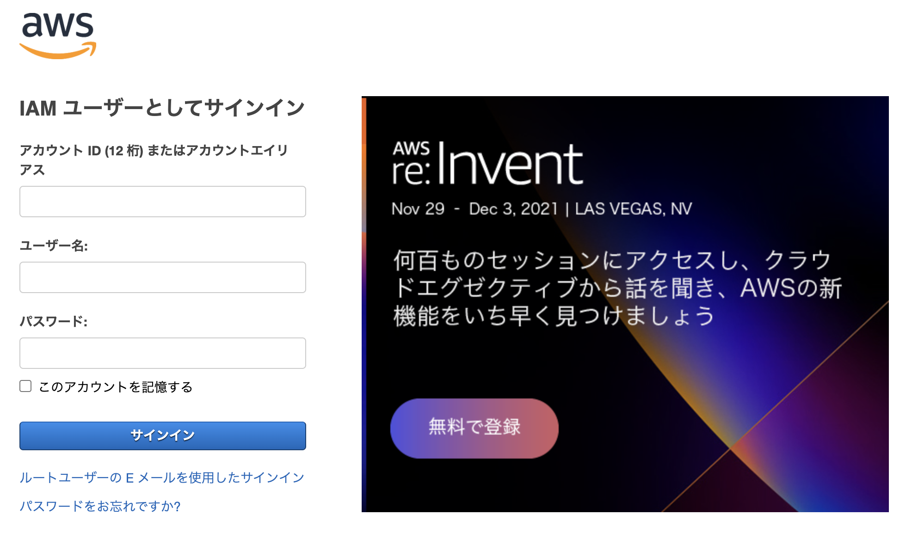
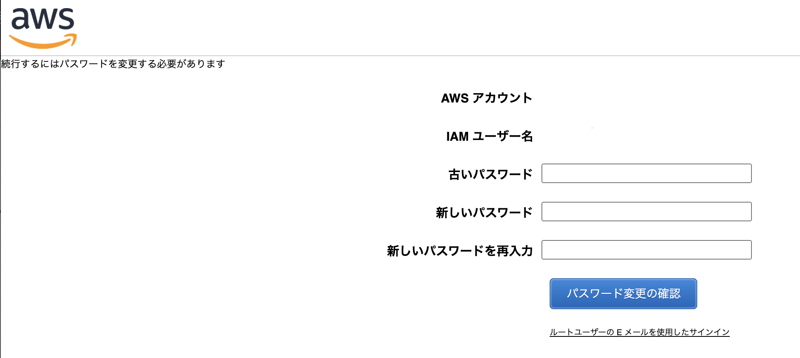
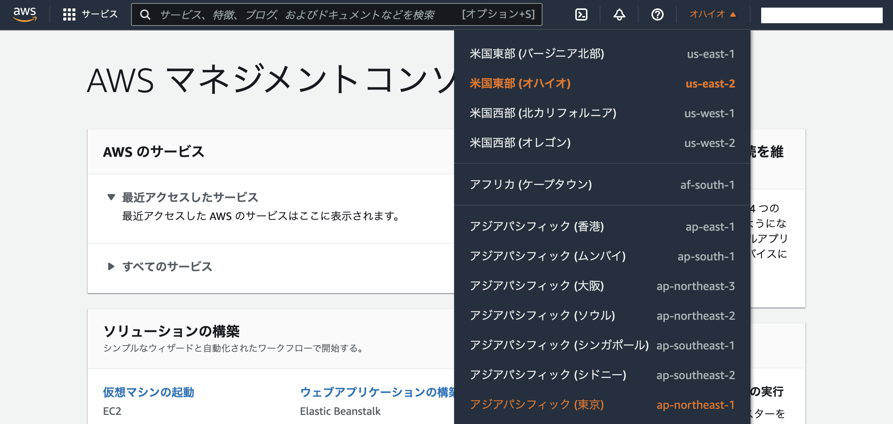
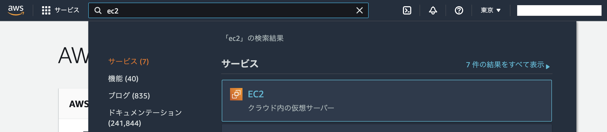
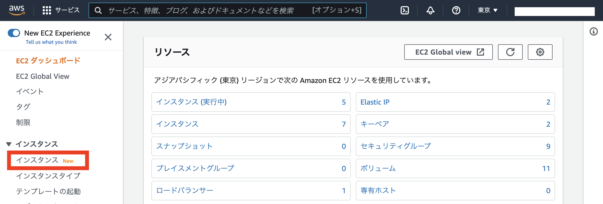
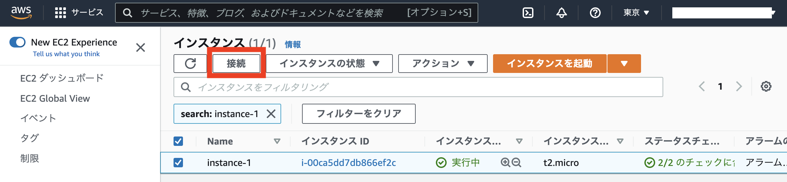
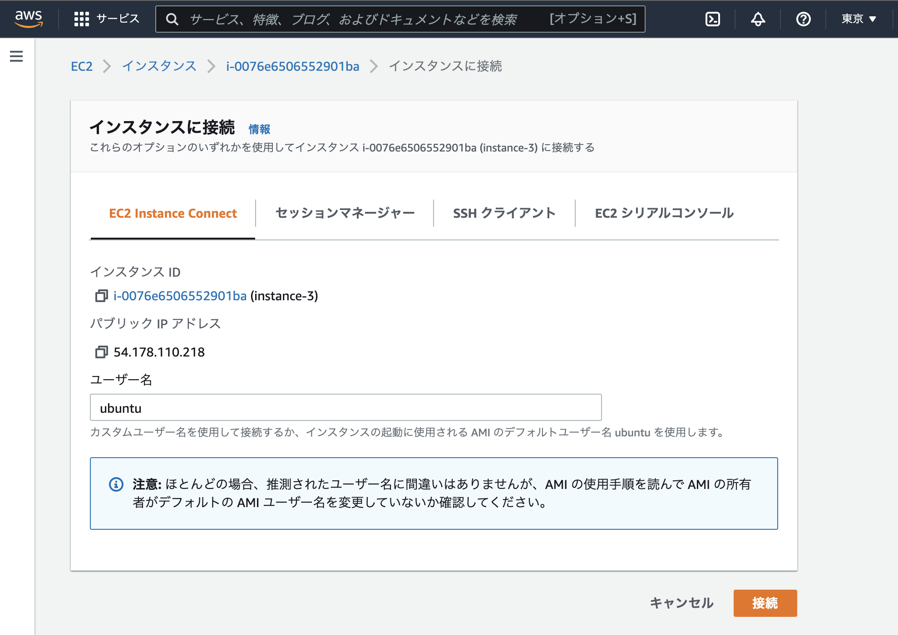
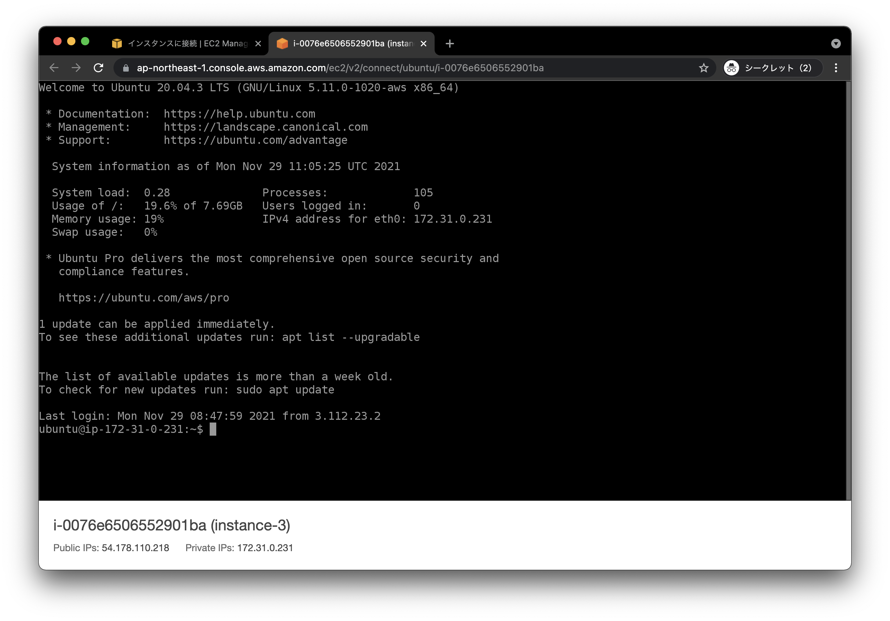

# ハンズオン環境へのログイン

## 1. AWSマネジメントコンソールへのログイン

今回ハンズオンに利用しているマシンはAmazon EC2のt2.microインスタンスとして起動しています。ハンズオン環境に対して直接SSHすることができないため、AWSマネジメントコンソールのEC2 Instance Connect機能を利用してハンズオンを進めます。自身の割当インスタンスのみ、開始・停止・ログインが可能です。

与えられたユーザー名とパスワードで[AWS マネジメントコンソール](https://console.aws.amazon.com/)にログインします。

## 2. パスワードの変更 (初回のみ)

ログインに成功するとパスワード変更画面が表示されます。任意のパスワードを設定してください。(※初回ログイン時のみパスワード変更が必要です。)

## 3. リージョンの変更

画面上部にあるリージョンを確認し、「アジアパシフィック(東京) ap-northeast-1」に変更します。

変更が反映され、リージョンとして「東京」が表示されていることを確認します。

## 4. EC2ダッシュボード

検索窓に「ec2」と入力し、表示されるサービスの「EC2」をクリックします。

## 5. インスタンスへの接続 (EC2 Instance Connect)

EC2ダッシュボードが開いたら、メニューの「インスタンス」をクリックします。

インスタンス一覧が表示されたら、検索窓に自身のインスタンス名を入力して検索し、選択した状態で「接続」をクリックします。

「インスタンスに接続」画面で「EC2 Instance Connect」が選択されて、ユーザー名として「ubuntu」が指定されていることを確認し、「接続」ボタンをクリックします。

ブラウザで新しいタブが開き、対象のインスタンスにsshが完了します。

---

[戻る](handson.html)
