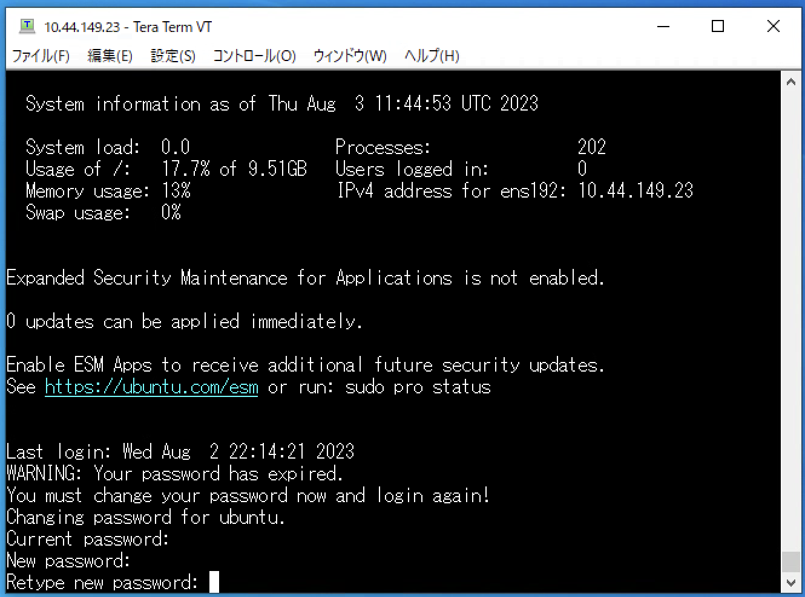

# ハンズオン環境へのログイン

## 1. ハンズオン環境へのログイン

今回ハンズオンに利用している環境には検証用VDIからSSHでアクセス可能です。与えられたユーザー名とパスワードにログインします。

## 2. パスワードの変更 (初回のみ)

ログインに成功すると初回はパスワードの変更を求められます。任意のパスワードを設定してください。パスワード変更後、SSHは自動的に切断されます。

---

[戻る](handson.html)
