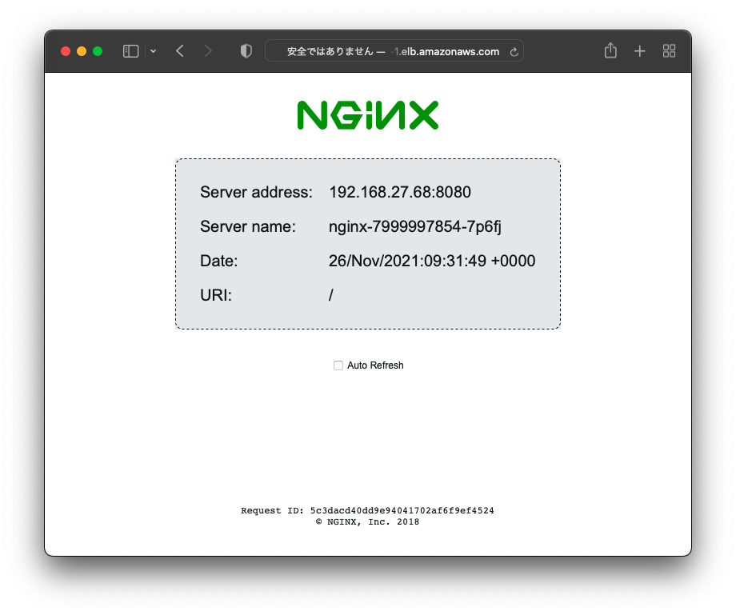

# Kubernetes Handson 3

## 10. Service

### 10.1. ClusterIP Serviceの作成

ClusterIP Serviceはクラスター内でのみ有効なServiceです。ClusterIP Serviceは一般的にネームスペース内のPod間通信で利用します。このIPアドレスはクラスター内でのみアクセスできるアドレスであり、クラスター外部からアクセスすることはできません。

作業用ディレクトリを変更します。

```bash
cd $HOME/handson/module3
```

Service作成用のマニフェストの内容を確認します。

```bash
cat nginx-service.yaml
```

`selector`として`app: nginx`を指定しているためネームスペース内の`app: nginx`ラベルが付いているPodがServiceの対象になります。

```yaml
apiVersion: v1
kind: Service
metadata:
  labels:
    app: nginx
  name: nginx
spec:
  ports:
  - port: 8080
    protocol: TCP
    targetPort: 8080
  selector:
    app: nginx
```

マニフェストを利用してServiceを作成します。

```bash
kubectl apply -f nginx-service.yaml
```

Serviceとしてnginxが作成され、TYPE=ClusterIPとなっていることを確認します。

```bash
kubectl get service
```

現在起動しているPodの情報を確認します。それぞれPodに割り当てられているIPアドレスに注意します。

```bash
kubectl get pod -o wide
```

Serviceをdescribeして詳細情報を表示します。Endpointsとして2つのPodのIPアドレスが登録されていることが確認できます。

```bash
kubectl describe service nginx
```

出力内容の例 : Podは192.168.27.68と192.168.39.143として起動しており、Endpointsとして各PodのIPアドレスが登録されています。

```bash
$ kubectl get pod -o wide
NAME                     READY   STATUS    RESTARTS   AGE   IP               NODE                                               NOMINATED NODE   READINESS GATES
nginx-7999997854-7p6fj   1/1     Running   0          30m   192.168.27.68    ip-192-168-28-60.ap-northeast-1.compute.internal   <none>           <none>
nginx-7999997854-b2hb8   1/1     Running   0          13m   192.168.39.143   ip-192-168-49-76.ap-northeast-1.compute.internal   <none>           <none>
$ kubectl describe service nginx
Name:              nginx
Namespace:         i-0a9fc72b1cb8d6054
Labels:            app=nginx
Annotations:       <none>
Selector:          app=nginx
Type:              ClusterIP
IP Family Policy:  SingleStack
IP Families:       IPv4
IP:                10.100.13.219
IPs:               10.100.13.219
Port:              <unset>  80/TCP
TargetPort:        8080/TCP
Endpoints:         192.168.27.68:8080,192.168.39.143:8080
Session Affinity:  None
Events:            <none>
```

Podを削除して再作成してみます。

```bash
kubectl delete pod $(kubectl get pod -o=jsonpath='{.items[1]..metadata.name}' -l app=nginx)
```

再度Podの起動状態を確認すると、新たなPodが起動しています。

```bash
kubectl get pod -o wide
```

Serviceを確認すると、EndpointもPodの情報が反映されています。

```
kubectl describe service nginx
```

### 10.2. ClusterIPに対するアクセス確認

起動済みのnginx Podにexecしてクラスター内でnginxのClusterIP Serviceにアクセスできることを確認します。

```bash
kubectl exec -it $(kubectl get pod -o=jsonpath='{.items[1]..metadata.name}' -l app=nginx) -- bash
```

Pod内のbashに切り替わったら、curlでnginxという名前にアクセスできることを確認します。nginxという名前のサービスがネームスペース内にあるため、名前解決が可能となっており、curlコマンドに対して応答があります。

```
curl nginx
```

ServiceはKubernetesクラスター内で、[サービス名].[ネームスペース名].svc.cluster.localというレコードとして名前解決が可能になっています。Podの`/etc/resolv.conf`を確認すると、`search`に検索リストとしてドメインが登録されている事がわかります。

```bash
cat /etc/resolv.conf
```

実際にdigコマンドで名前解決をすると、CLUSTER-IPが帰ってくることが確認できます。([ネームスペース名]は各自自分のものを入力してください)

```bash
nslookup nginx.[ネームスペース名].svc.cluster.local
```

出力例

```bash
bash-5.1$ nslookup nginx.i-0076e6506552901ba.svc.cluster.local
Server:10.100.0.10
Address:10.100.0.10#53

Name:nginx.i-0076e6506552901ba.svc.cluster.local
Address: 10.100.38.56
```

exitコマンドでPodのシェルからexitします。

```bash
exit
```

### 10.3. LoadBalancer Serviceの作成

LoadBalancer Serviceはサービスをクラスター外部からアクセス可能にするリソースです。外部ロードバランサーと連携し、クラスター外部からアクセス可能なEXTERNAL-IPを動的に払い出します。

Service作成用のマニフェストの内容を確認します。

```bash
cat nginx-lb.yaml
```

先程作成したClusterIPとほぼ同じ内容ですが、`.spec.type: LoadBalancer`を追加しています。

```yaml
apiVersion: v1
kind: Service
metadata:
  labels:
    app: nginx
  name: nginx-lb
spec:
  ports:
  - port: 80
    protocol: TCP
    targetPort: 80
  selector:
    app: nginx
  type: LoadBalancer
```

マニフェストを利用してServiceを作成します。

```bash
kubectl apply -f nginx-lb.yaml
```

### 10.4. LoadBalancerに対するアクセス確認

Service TYPE=LoadBalancerとしてnginx-lbが作成され、EXTERNAL-IPとして`XXXXXXXXXXX.ap-northeast-1.elb.amazonaws.com `のようなアドレスが割り当てられていることを確認します。(しばらく時間がかかる場合があります)

出力内容の例

```bash
$ kubectl get svc
NAME       TYPE           CLUSTER-IP      EXTERNAL-IP                                                                    PORT(S)        AGE
nginx      ClusterIP      10.100.13.219   <none>                                                                         80/TCP         22m
nginx-lb   LoadBalancer   10.100.30.2     a22ad4de22aa94d53be2c5b7930ba76f-1051250147.ap-northeast-1.elb.amazonaws.com   80:32495/TCP   75s
```

Amazon EKS環境では、外部ロードバランサーとしてAmazon ELBの**Classic Load Balancer**を利用します。Serviceを`type: LoadBalancer`として作成したことで、Classc Load Bancerが払い出されたことになります。

>  Classic Load Balancerがアクセス可能になるまで、長い場合は2分程度待つ必要があります。

curlコマンドでEXTERNAL-IPに繰り返しアクセスするとnginxが応答しており、クラスター内で各Podに対してアクセスが分散している様子を確認できます。

```bash
$ curl a485e6483910a4c62986dde42df5e850-806133995.ap-northeast-1.elb.amazonaws.com
Server address: 192.168.27.68:8080
Server name: nginx-7999997854-7p6fj
Date: 26/Nov/2021:09:43:00 +0000
URI: /
Request ID: f96682bfa69e2deb8babe9d9f2f0494a
Image Version: 2.0

$ curl a485e6483910a4c62986dde42df5e850-806133995.ap-northeast-1.elb.amazonaws.com
Server address: 192.168.39.143:8080
Server name: nginx-7999997854-b2hb8
Date: 26/Nov/2021:09:43:03 +0000
URI: /
Request ID: f621e01e26a5c20e76c49239a4cb4855
Image Version: 2.0
```

手元のPC上でブラウザを開き、EXTERNAL-IPにアクセスするとnginxのウェブページを確認することができます。



### 10.5. LoadBalancerサービスの削除

作成したLoadBalancerサービスを削除します。(コマンド入力後、サービスが削除されてプロンプトが戻るまで数秒かかります)

> AWSのサービスQuotaによりリージョン辺りのLoadBalancer数が制限されています。この後のハンズオンで再度LoadBalancerを作成するため、必ずここで作成したLoadBalancer Serviceを削除してください。

```bash
kubectl delete -f nginx-lb.yaml
```


## 11. Ingress

### 11.1. Ingressの作成

新しいDeploymentとServiceをnginx2として作成します。

```bash
kubectl apply -f nginx2.yaml
```

Deployment, Service, Podが作成されたことを確認します。

```bash
kubectl get deploy,service,pod
```

Ingress作成用のマニフェストのテンプレートの内容を確認します。

```bash
cat ingress.yaml
```

FQDN `nginx.exmaple.com`に対するアクセスの中で、`/n1`に対するアクセスは`nginx`サービスに、`/n2`に対するアクセスは`nginx2`にルーティングする設定となっています。なおAWS上でIngressリソースとAmazon ELBを連携するために3種類のAnnotationが指定されています。

> 通常IngressリソースはDNSで名前解決可能なFQDNを利用して構成しますが、本環境では利用可能なドメイン名が無いため、ダミーのFQDNとしてnginx.example.comを利用します。

```yaml
apiVersion: networking.k8s.io/v1
kind: Ingress
metadata:
  annotations:
    alb.ingress.kubernetes.io/scheme: internet-facing
    alb.ingress.kubernetes.io/target-type: ip
    kubernetes.io/ingress.class: alb
  name: nginx
spec:
  rules:
  - host: nginx.example.com
    http:
      paths:
      - backend:
          service:
            name: nginx
            port:
              number: 80
        path: /n1
        pathType: Exact
      - backend:
          service:
            name: nginx2
            port:
              number: 80
        path: /n2
        pathType: Exact
```

マニフェストを利用してServiceを作成します。

```bash
kubectl apply -f ingress.yaml
```

### 11.2. Ingressに対するアクセス確認

Ingressとしてnginxが作成され、ADDRESSとして`k8s-XXXXXX.ap-northeast-1.elb.amazonaws.com`のようなアドレスが割り当てられていることを確認します。(しばらく時間がかかる場合があります)

```bash
kubectl get ingress
```

Amazon EKS環境では、IngressリソースとしてAmazon ELBの**Application Load Balancer**を利用することが可能です。Ingressリソースを作成したことによりApplication Load Bancerが払い出されたことになります。

>  Applicaiton Load Balancerがアクセス可能になるまで、長い場合は2分程度待つ必要があります。

構成されたIngressのADDRESSを`INGRESS`環境変数に設定します。

```bash
INGRESS=$(kubectl get ingress nginx -o=jsonpath='{.status.loadBalancer.ingress[].hostname}')
```

Ingress ADDRESSの一つを`VIP`環境変数に設定します。

```bash
VIP=$(dig +short $INGRESS | head -n1)
```

環境変数INGRESSとVIPの内容を確認します。環境変数が正しく設定されていない場合は、しばらく待ってから再度INGRESS/VIPの環境変数の取得を試みてください。

```bash
echo $VIP, $INGRESS
```

curlコマンドでIngress向けにアクセスします。IngressはHTTPアクセスのリクエストに含まれるHostヘッダを確認するため、シンプルなIngress向けのHTTPアクセスは404エラーとなります。

```bash
curl -D - $INGRESS/n1
```

curlの`---resolv`オプションを利用し、IngressのIPアドレス宛に`nginx.example.com/n1`としてアクセスします。バックエンドはnginxサービスであるため、HTTPレスポンスボディに含まれる「Server name」は`nginx-xxxxxxxxxx-yyyyy`となります。

```bash
curl --resolv nginx.example.com:80:$VIP http://nginx.example.com/n1
```

curlの`---resolv`オプションを利用し、IngressのIPアドレス宛に`nginx.example.com/n2`としてアクセスします。バックエンドはnginx2サービスであるため、HTTPレスポンスボディに含まれる「Server name」は`nginx2-xxxxxxxxxx-yyyyy`となります。

出力内容の例

```bash
$ curl --resolv nginx.example.com:80:$VIP http://nginx.example.com/n1
Server address: 192.168.39.143:8080
Server name: nginx-7999997854-b2hb8
Date: 26/Nov/2021:10:47:41 +0000
URI: /n1
Request ID: a254c4125f08a1ab0a9be4674cdb5726
Image Version: 2.0

$ curl --resolv nginx.example.com:80:$VIP http://nginx.example.com/n2
Server address: 192.168.60.38:8080
Server name: nginx2-68649c9976-lllmj
Date: 26/Nov/2021:10:47:44 +0000
URI: /n2
Request ID: c558ad7b7438d7dafe6576c3d3ebd2c5
Image Version: 2.0
```

Ingressをdescribeして詳細情報を表示します。/n1と/n2のパスに対するBackendとして各Serivceが登録され、ServiceのメンバーであるPodのIPアドレスが表示されます。

```bash
$ kubectl describe ingress nginx
Name:             nginx
Namespace:        
Address:          k8s-i-0a9fc72b1cb8d6054-nginx-850bb726e4-809045765.ap-northeast-1.elb.amazonaws.com
Default backend:  default-http-backend:80 (<error: endpoints "default-http-backend" not found>)
Rules:
  Host               Path  Backends
  ----               ----  --------
  nginx.example.com
                     /n1   nginx:80 (192.168.27.68:8080,192.168.39.143:8080)
                     /n2   nginx2:80 (192.168.60.38:8080)
Annotations:         alb.ingress.kubernetes.io/scheme: internet-facing
                     alb.ingress.kubernetes.io/target-type: ip
                     kubernetes.io/ingress.class: alb
Events:
  Type    Reason                  Age    From     Message
  ----    ------                  ----   ----     -------
  Normal  SuccessfullyReconciled  2m31s  ingress  Successfully reconciled
```

## 12. リソースの削除

Handson 3で作成したリソースを全て削除します。(「 services "nginx-lb" not found」エラーが表示されますが、nginx-lbがすでに削除されているためです)

```bash
kubectl delete -f .
```

nginx Dpeloymentも削除します。

```bash
kubectl delete deploy nginx
```

全てのリソースが削除されたことを確認します。(ingressリソースの削除は少し時間がかかる場合があります)

```bash
kubectl get pod,ingress,svc
```

---

[戻る](handson.html)
