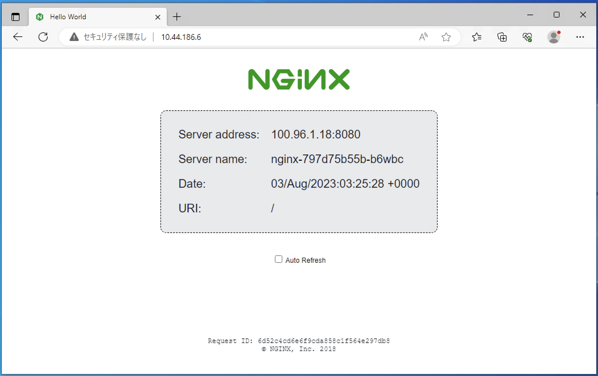

# Kubernetes Handson 3

## 10. Service

### 10.1. ClusterIP Serviceの作成

ClusterIP Serviceはクラスター内でのみ有効なServiceです。ClusterIP Serviceは一般的にネームスペース内のPod間通信で利用します。このIPアドレスはクラスター内でのみアクセスできるアドレスであり、クラスター外部からアクセスすることはできません。

作業用ディレクトリを変更します。

```bash
cd $HOME/handson/module3
```

Service作成用のマニフェストの内容を確認します。

```bash
cat nginx-service.yaml
```

`selector`として`app: nginx`を指定しているためネームスペース内の`app: nginx`ラベルが付いているPodがServiceの対象になります。

```yaml
apiVersion: v1
kind: Service
metadata:
  labels:
    app: nginx
  name: nginx
spec:
  ports:
  - port: 8080
    protocol: TCP
    targetPort: 8080
  selector:
    app: nginx
```

マニフェストを利用してServiceを作成します。

```bash
kubectl apply -f nginx-service.yaml
```

Serviceとしてnginxが作成され、TYPE=ClusterIPとなっていることを確認します。

```bash
kubectl get service
```

現在起動しているPodの情報を確認します。それぞれPodに割り当てられているIPアドレスに注意します。

```bash
kubectl get pod -o wide
```

Serviceをdescribeして詳細情報を表示します。Endpointsとして2つのPodのIPアドレスが登録されていることが確認できます。

```bash
kubectl describe service nginx
```

出力内容の例 : Podは`100.96.1.18`と`100.96.4.7`として起動しており、ServiceのEndpointsとして各PodのIPアドレスが登録されています。

```bash
$ kubectl get pod -o wide
NAME                     READY   STATUS    RESTARTS   AGE   IP            NODE                                   NOMINATED NODE   READINESS GATES
nginx-797d75b55b-b6wbc   1/1     Running   0          12m   100.96.1.18   tkc01-workers-7rdsp-77c6f677f9-db9gc   <none>           <none>
nginx-797d75b55b-mcmkd   1/1     Running   0          12m   100.96.4.7    tkc01-workers-7rdsp-77c6f677f9-ds2kl   <none>           <none>

$ kubectl describe service nginx
Name:              nginx
Namespace:         handson-02
Labels:            app=nginx
Annotations:       <none>
Selector:          app=nginx
Type:              ClusterIP
IP Family Policy:  SingleStack
IP Families:       IPv4
IP:                100.69.167.69
IPs:               100.69.167.69
Port:              <unset>  80/TCP
TargetPort:        8080/TCP
Endpoints:         100.96.1.18:8080,100.96.4.7:8080
Session Affinity:  None
Events:            <none>
```

Podを削除して再作成してみます。

```bash
kubectl delete pod $(kubectl get pod -o=jsonpath='{.items[1]..metadata.name}' -l app=nginx)
```

再度Podの起動状態を確認すると、新たなPodが起動しています。

```bash
kubectl get pod -o wide
```

Serviceを確認すると、EndpointもPodの情報が反映されています。

```
kubectl describe service nginx
```

### 10.2. ClusterIPに対するアクセス確認

起動済みのnginx Podにexecしてクラスター内でnginxのClusterIP Serviceにアクセスできることを確認します。

```bash
kubectl exec -it $(kubectl get pod -o=jsonpath='{.items[1]..metadata.name}' -l app=nginx) -- bash
```

Pod内のbashに切り替わったら、curlでnginxという名前にアクセスできることを確認します。nginxという名前のサービスがネームスペース内にあるため、名前解決が可能となっており、curlコマンドに対して応答があります。

```
curl nginx
```

ServiceはKubernetesクラスター内で、[サービス名].[ネームスペース名].svc.cluster.localというレコードとして名前解決が可能になっています。Podの`/etc/resolv.conf`を確認すると、`search`に検索リストとしてドメインが登録されている事がわかります。

```bash
cat /etc/resolv.conf
```

実際にdigコマンドで名前解決をすると、CLUSTER-IPが帰ってくることが確認できます。([ネームスペース名]は各自自分のものを入力してください)

```bash
nslookup nginx.[ネームスペース名].svc.cluster.local
```

出力例

```bash
bash-5.1$ nslookup nginx.handson-15.svc.cluster.local
Server:         100.64.0.10
Address:        100.64.0.10#53

Name:   nginx.handson-15.svc.cluster.local
Address: 100.69.167.69
```

exitコマンドでPodのシェルからexitします。

```bash
exit
```

### 10.3. LoadBalancer Serviceの作成

LoadBalancer Serviceはサービスをクラスター外部からアクセス可能にするリソースです。外部ロードバランサーと連携し、クラスター外部からアクセス可能なEXTERNAL-IPを動的に払い出します。

Service作成用のマニフェストの内容を確認します。

```bash
cat nginx-lb.yaml
```

先程作成したClusterIPとほぼ同じ内容ですが、`.spec.type: LoadBalancer`を追加しています。

```yaml
apiVersion: v1
kind: Service
metadata:
  labels:
    app: nginx
  name: nginx-lb
spec:
  ports:
  - port: 80
    protocol: TCP
    targetPort: 80
  selector:
    app: nginx
  type: LoadBalancer
```

マニフェストを利用してServiceを作成します。

```bash
kubectl apply -f nginx-lb.yaml
```

### 10.4. LoadBalancerに対するアクセス確認

Service TYPE=LoadBalancerとしてnginx-lbが作成され、EXTERNAL-IPとして`10.44.186.X `のようなアドレスが割り当てられていることを確認します。(しばらく時間がかかる場合があります)

出力内容の例

```bash
$ kubectl get svc
NAME       TYPE           CLUSTER-IP      EXTERNAL-IP   PORT(S)        AGE
nginx      ClusterIP      100.69.167.69   <none>        80/TCP         2m37s
nginx-lb   LoadBalancer   100.71.64.161   10.44.186.6   80:30752/TCP   5s
```

今回のTanzu Kubernetes Grid環境では、外部ロードバランサーとしてNSXのLoad Balancerを利用します。Serviceを`type: LoadBalancer`として作成したことで、NSXのロードバランサーでL4 TCPの仮想サーバが払い出されたことになります。

curlコマンドでEXTERNAL-IPにアクセスするとnginxが応答しており、クラスター内で各Podに対してアクセスが分散している様子を確認できます。

```bash
$ curl 10.44.186.6
Server address: 100.96.5.9:8080
Server name: nginx-797d75b55b-sld2m
Date: 03/Aug/2023:03:24:22 +0000
URI: /
Request ID: 158fa7707064962fa1b3569bad3847c2
Image Version: 2.0

$ curl 10.44.186.6
Server address: 100.96.1.18:8080
Server name: nginx-797d75b55b-b6wbc
Date: 03/Aug/2023:03:25:06 +0000
URI: /
Request ID: 0a77e21cce27dd5bafeca44a0bd6853d
Image Version: 2.0
```

手元のPC上でブラウザを開き、EXTERNAL-IPにアクセスするとnginxのウェブページを確認することができます。



### 10.5. LoadBalancerサービスの削除

作成したLoadBalancerサービスを削除します。

```bash
kubectl delete -f nginx-lb.yaml
```

## 11. Ingress

### 11.1. Ingressの作成

新しいDeploymentとServiceをnginx2として作成します。

```bash
kubectl apply -f nginx2.yaml
```

Deployment, Service, Podが作成されたことを確認します。

```bash
kubectl get deploy,service,pod
```

Ingress作成用のマニフェストのテンプレートの内容を確認します。

```bash
cat ingress.yaml
```

FQDN `${NS}.tanzu.techlab.netone.co.jp`に対するアクセスの中で、`/n1`に対するアクセスは`nginx`サービスに、`/n2`に対するアクセスは`nginx2`にルーティングする設定となっています。

```yaml
apiVersion: networking.k8s.io/v1
kind: Ingress
metadata:
  annotations:
    kubernetes.io/ingress.class: contour
  name: nginx
spec:
  rules:
  - host: ${NS}.tanzu.techlab.netone.co.jp
    http:
      paths:
      - backend:
          service:
            name: nginx
            port:
              number: 80
        path: /n1
        pathType: Exact
      - backend:
          service:
            name: nginx2
            port:
              number: 80
        path: /n2
        pathType: Exact
```

マニフェスト内の`${NS}`は環境固有の値として修正する必要があるため、`envsubst`コマンドを利用して環境変数で上書きしてServiceを作成します。

```bash
envsubst < ingress.yaml  | kubectl apply -f -
```

### 11.2. Ingressに対するアクセス確認

Ingressとしてnginxが作成され、HOSTとして`handson-XX.tanzu.techlab.netone.co.jp`のようなFQDNが構成され、`ADDRESS`としてIPアドレスが割り当てられていることを確認します。

```bash
kubectl get ingress
```

今回のTanzu Kubernetes Grid環境では、Ingressとして[Contour](https://projectcontour.io)を利用しています。Contourはデータプレーンとして[Envoy Proxy](https://www.envoyproxy.io)を利用しています。Ingressリソースを作成したことにより、Contour はEnvoyに対してL7ルーティングを構成し、FQDNによってアクセス先を変更します。

構成されたIngressのHOSTを`INGRESS`環境変数、IPアドレスを`VIP`に設定します。

```bash
INGRESS=$(kubectl get ingress nginx -o=jsonpath='{.spec.rules[].host}')
```

```bash
VIP=$(kubectl get ingress nginx -o=jsonpath='{.status.loadBalancer.ingress[].ip}')
```

curlコマンドでIngress IPアドレスにアクセスします。IngressはHTTPアクセスのリクエストに含まれるHostヘッダを確認するため、IPアドレス向けのHTTPアクセスは404エラーとなります。

```bash
curl -D - $VIP/n1
```

Ingress FQDNの`/n1`にアクセスします。バックエンドはnginxサービスであるため、HTTPレスポンスボディに含まれる「Server name」は`nginx-xxxxxxxxxx-yyyyy`となります。

```bash
curl -D - $INGRESS/n1
```

Ingress FQDNの`/n2`にアクセスします。バックエンドはnginx2サービスであるため、HTTPレスポンスボディに含まれる「Server name」は`nginx2-xxxxxxxxxx-yyyyy`となります。

出力内容の例

```bash
$ curl $INGRESS/n1
Server address: 100.96.1.18:8080
Server name: nginx-797d75b55b-b6wbc
Date: 03/Aug/2023:08:04:41 +0000
URI: /n1
Request ID: c8a2ad05c64afc0dc06a2b036770b1f0
Image Version: 2.0

$ curl $INGRESS/n2
Server address: 100.96.4.8:8080
Server name: nginx2-5f7457fcc6-j9k2n
Date: 03/Aug/2023:08:04:42 +0000
URI: /n2
Request ID: 3979d69da7c7e0a7715126122890c0d7
Image Version: 2.0
```

Ingressをdescribeして詳細情報を表示します。/n1と/n2のパスに対するBackendとして各Serivceが登録され、ServiceのメンバーであるPodのIPアドレスが表示されます。

```bash
$ kubectl describe ingress nginx
Name:             nginx
Labels:           <none>
Namespace:        handson-02
Address:          10.44.186.5
Ingress Class:    <none>
Default backend:  <default>
Rules:
  Host                                   Path  Backends
  ----                                   ----  --------
  handson-02.tanzu.techlab.netone.co.jp
                                         /n1   nginx:80 (100.96.1.18:8080,100.96.5.9:8080)
                                         /n2   nginx2:80 (100.96.4.8:8080)
Annotations:                             kubernetes.io/ingress.class: contour
Events:                                  <none>
```

## 12. リソースの削除

Handson 3で作成したリソースを全て削除します。(「 services "nginx-lb" not found」エラーが表示されますが、nginx-lbがすでに削除されているためです)

```bash
kubectl delete -f .
```

nginx Dpeloymentも削除します。

```bash
kubectl delete deploy nginx
```

全てのリソースが削除されたことを確認します。(ingressリソースの削除は少し時間がかかる場合があります)

```bash
kubectl get pod,ingress,svc
```

---

[戻る](handson.html)
