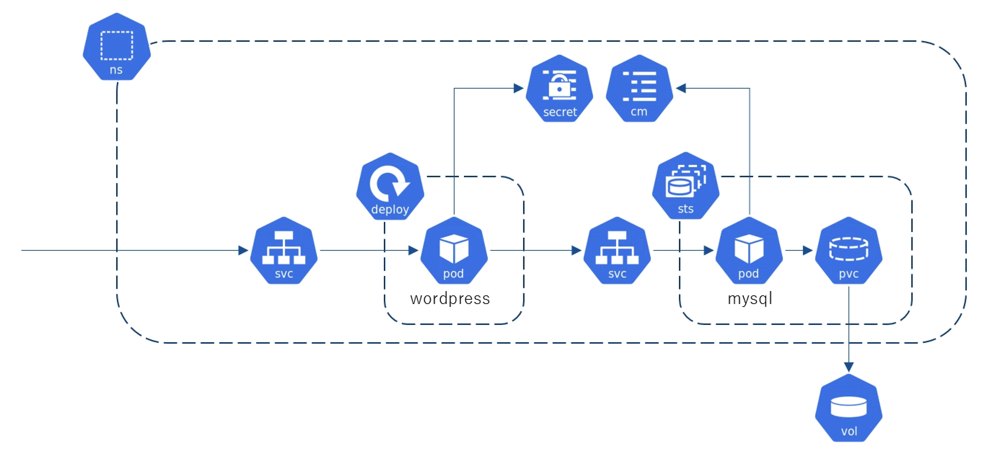

# Kubernetes Handson 5

## 19. Wordpressの構築

CMS(Content Management System)であるWordpressをKubernetes環境で構築します。Wodpressはphpで実装されており、バックエンドデータベースとしてMySQLを利用します。本ハンズオンではwordpressとMySQLをそれぞれPodとして作成し、Serviceによりクラスター外に公開します。

以下の要件を満たすようマニフェストを作成し、実装してみましょう。Wodrepss及びMySQLが利用する各種環境変数はSecret/ConfigMapを利用して実装してみましょう。

>  ハンズオンフォルダ($HOME/handson/module5)に回答例があります。



### wodpress

- Deployment
  - コンテナイメージ : [wordpress:latest](https://hub.docker.com/_/wordpress)
  - レプリカ数 : 1
  - 環境変数
    - データベースホスト名 : WORDPRESS_DB_HOST
    - データベース名 : WORDPRESS_DB_NAME
    - データベースユーザー名 : WORDPRESS_DB_USER
    - データベースパスワード : WORDPRESS_DB_PASSWORD
- Service
  - ポート : 80
  - Type : LoadBalancer

### Mysql

- StatefulSet
  - コンテナイメージ : [mysql:5](https://hub.docker.com/_/mysql?tab=tags)
  - レプリカ数 : 1
  - 環境変数
    - 管理者パスワードの設定 : MYSQL_RANDOM_ROOT_PASSWORD
    - データベース名 : MYSQL_DATABASE
    - データベースユーザー名 : MYSQL_USER
    - データベースパスワード : MYSQL_PASSWORD
  - ボリューム
    - マウントパス : /var/lib/mysql
    
    - EKS の永続ボリュームではファイルシステムのルートに lost+found のディレクトリが存在するため、 MySQL コンテナの初期化処理がエラーとなってしまい、異常終了します。そのため、subPath を設定し、空のディレクトリをマウントするようにします。
    
      ```yaml
          volumeMounts:
          - mountPath: /var/lib/mysql
            name: mysql-data
            subPath: mysql 
      ```
  - ボリューム要求
    - アクセスモード : ReadWriteOnce
    - StorageClass : gp2
    - ストレージ容量 : 2Gi
  
- Service
  - ポート : 3306
  - Type : ClusterIP

---

[戻る](handson.html)